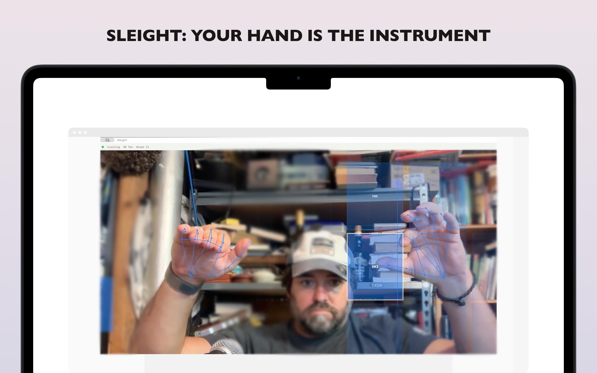

# Sleight

*Sleight of hand for your DAW.*



Sleight is a native macOS app that turns hand and finger movement — tracked from
your webcam at 21 landmarks per hand via Apple Vision — into expressive MIDI.
No gloves, no sensors, no calibration ritual. Your hands are the controller.

https://sleightapp.xyz

## Quickstart (20 seconds)

1. Open Sleight. Allow camera access.
2. In Logic Pro (or any DAW), pick **Sleight** as the MIDI input on an instrument track.
3. Play:
   - **Right hand** moves horizontally → pitch (quantized to your chosen scale, or free)
   - **Left hand** moves vertically → volume (drop it low to mute)
   - **Pinch** (thumb + index) → note on/off
   - **Wave your hand** at singing-vibrato speed (4–8 Hz) → real vibrato; slow drift is filtered out
4. No DAW open? Toggle off **Practice (silent)** and the built-in synth sounds instead.

## Instruments

| Instrument | Status | Control scheme |
|---|---|---|
| Theremin | ✅ v2 | right-hand X → pitch · left-hand Y → volume · pinch → gate · 4–8 Hz oscillation → vibrato · glide while held |
| Poly Pads | ✅ v2.1 | right-hand Y → pitch per finger (index/middle/ring/little) · finger extension → gate · per-note bend · left hand → shared volume |
| Ribbon | 🔜 v3 | 1D pitch strip + pressure |
| Keyboard grid | 🔜 later | novelty mode — a real keybed still wins for fast runs |

## MIDI protocol

Sleight emits three protocols from a virtual source named **Sleight** (Settings → MIDI protocol):

| Mode | What you get | Use when |
|---|---|---|
| **MIDI 2.0 (UMP)** (default) | 16-bit velocity, 32-bit per-note pitch bend, explicit bend-range RPN | DAW + instruments with MIDI 2.0 support |
| **MPE (MIDI 1.1)** | Standard MPE: global CC on ch 1, notes + per-note bend (±48) on ch 2–5 | Any MPE-capable instrument (most modern DAWs). Poly Pads uses channels 2–5 for 2–4 simultaneous voices. |
| **MIDI 1.1** | Classic bytes — pitch bend ±2 (user-selectable range) | Older hosts that only list MIDI 1.0 sources |

**Glide**: while a note is held (pinched or extended), pitch follows your hand continuously instead of stepping to the next scale tone — the scale quantizes where notes *start* (articulation), the smear between tones is the expression. UMP and MPE only; the toggle is disabled in MIDI 1.1 mode.

If your DAW doesn't list **Sleight** after a protocol change, it caches source enumeration: restart the DAW's MIDI device list (or switch the mode once more).

## Latency

Camera-to-MIDI pipeline budget on Apple Silicon (see
`docs/superpowers/specs/2026-08-27-sleight-design.md` §6):

| Stage | Cost |
|---|---|
| Camera exposure + readout | 8–16 ms (hardware) |
| Vision hand pose (ANE) | 3–8 ms |
| One-Euro filter + mapping | < 1 ms |
| CoreMIDI delivery | < 1 ms |
| **End-to-end perceived** | **15–40 ms** |

That's the same band as a MIDI keyboard through a software instrument.

## Requirements

- macOS 14+, Apple Silicon (M1 or newer)
- Any webcam (built-in FaceTime HD is fine)
- A DAW or hardware synth that accepts MIDI (only if you want sound beyond the test synth)

## Building from source

Requires **full Xcode** (not just Command Line Tools) and Apple Silicon.

```bash
brew install xcodegen
git clone https://github.com/james-see/sleight && cd sleight
xcodegen
open sleight.xcodeproj   # ⌘R
```

If `xcodebuild` says the active developer directory is Command Line Tools:

```bash
sudo xcode-select -s /Applications/Xcode.app/Contents/Developer
```

## How it works

```
Camera (30–60fps) → Vision hand pose (21 pts × 2 hands, ANE) → One-Euro filter
  → instrument mapping (pluggable) → CoreMIDI virtual source "Sleight"
                                    ↘ SwiftUI Canvas overlay (skeleton, zones, pinch ring)
```

The pipeline never queues frames (stale frames are useless for a real-time
instrument), drops work when tracking falls behind, and every MIDI event is
timestamped from the camera frame's host time. Hands leaving the frame always
fire a note-off — no stuck notes, ever.

## AR Pad Overlay (v2.4)

When **AR Pads** is enabled (default for Poly Pads), floating semi-transparent
pads appear over the camera preview showing you exactly where to land your
fingers. Overlay coordinates share the preview's aspect-fill crop so pads and
skeleton sit on the hands. Hover over a pad, then curl a finger to press it.
Each pad shows its note name and highlights when hovered or pressed.

The pads use perspective styling (slight shrink with vertical position) to
suggest depth, but tracking is 2D via Vision's normalized hand landmarks — no
ARKit or 3D framework required. Pad layout auto-adjusts to your pad count
(4–16 in a grid).

**Ghost-note filter:** a press that is held shorter than a 16th or 32nd (Settings →
BPM + subdivision, default 120 BPM / 32nd ≈ 63 ms) never emits MIDI. One-frame
Vision flickers are ignored on both attack and release.

## Audio Delegation (v2.2)

Sleight's internal synth and MIDI broadcast are now decoupled:

- **Auto-mute when DAW connected** (default on): when a MIDI host (Logic, etc.)
  is detected via CoreMIDI destination polling, the internal synth auto-mutes.
  MIDI still broadcasts to the host — you hear Logic's instruments, not Sleight's
  test synth.
- **Mute Sleight (Logic-only audio)**: manually silence the internal synth
  without affecting MIDI. Previously, muting the synth also stopped MIDI output;
  this is now fixed.
- **Practice (silent)**: still mutes both synth and MIDI for silent practice.

None of these settings gate `midiSource.send()` — MIDI always flows unless
Practice mode is on.

## Roadmap

- v2 ✅: MIDI 2.0 / MPE / MIDI 1.1 output (per-note pitch bend, 32-bit), glide mode
- v2.1 ✅: per-finger polyphony (2–4 simultaneous MPE notes via Poly Pads)
- v2.2 ✅: floating AR pad overlays + auto-mute synth when DAW connected
- v2.3 ✅: 12 AR pads with note labels + finger-curl press gate + minor scale
- v2.4 ✅: aspect-fill overlay alignment, stable pad highlights, tempo-relative ghost-note filter
- v3: ESP32 wireless-glove mode (IMU-fused tracking for away-from-desk play), AUv3 plugin, ribbon instrument

## License

MIT — see [LICENSE](LICENSE).